# CalculiX Benchmark Study: Two-Dimensional Blisk

The analytical and finite element analysis results of a two-dimensional rotating blisk problem are compared. The free and open-source finite element analysis software [CalculiX](http://www.calculix.de/) is used. The blisk is modelled using axisymmetric elements for the disk portion and plane strain elements for the blade portion.

### Files
File| Contents|                        
:-------------| :-------------|                   
[blisk_pre.fbd](blisk_pre.fbd)| Pre-processing script for CalculiX GraphiX|
[blisk.inp](blisk.inp) | CalculiX input|
[blisk_post.fbd](blisk_post.fbd)| Post-processing script for CalculiX GraphiX|               
[run_blisk_py.py](run_blisk_py.py)| Python script to run CalculiX files|
[load_calculix_data.m](load_calculix_data.m)| MATLAB file that loads CalculiX results to MATLAB workspace|
[blisk_matlab.m](blisk_matlab.m)| Main MATLAB file|
[blisk_tex.tex](blisk_tex.tex)| LaTeX file for the study report|
[blisk_tex.pdf](blisk_tex.pdf)| LaTeX output pdf for the study report|

### Parameters

| Parameter         | Value     | Unit          | Description             |
| :-------------    |  :----    | :----         | :-------------          |
| `r_i`             | 100       | mm            | Bore radius             |
| `r_e`             | 400       | mm            | Hub radius              |
| `R`               | 600       | mm            | Tip radius              |
| `h`               | 10        | mm            | Thickness of the disk   |
| `w`               | 10        | mm            | Width of the blade   |
| `N`               | 24        |               | Number of blades        |
| `k`               | 0.5       |               | Blade volume ratio |
| `E`               | 2.1e5     | MPa           | Young's modulus of the blisk material   |
| `nu`              | 0.3       |               | Poisson's ration of the blisk material |
| `gamma`           | 7.8e-9    | tonne/mm^3    | Density of the blisk material          |
| `omega`           | 1800      | rpm           | Rotational speed of the blisk          |
| `axisEtyp`        | qu8cr     |               | Element type of the disk portion (CAX8R)  |   
| `psEtyp`          | qu8sr     |               | Element type of the blade portion (CPS8R)   |  

## Rotating Blisk Problem

Consider the following two-dimensional rotating blisk (disk with integral blades) problem shown in the following [Figure](images/parametric_blisk.png) based on [the reference book](https://www.springer.com/gp/book/9788847025615).

    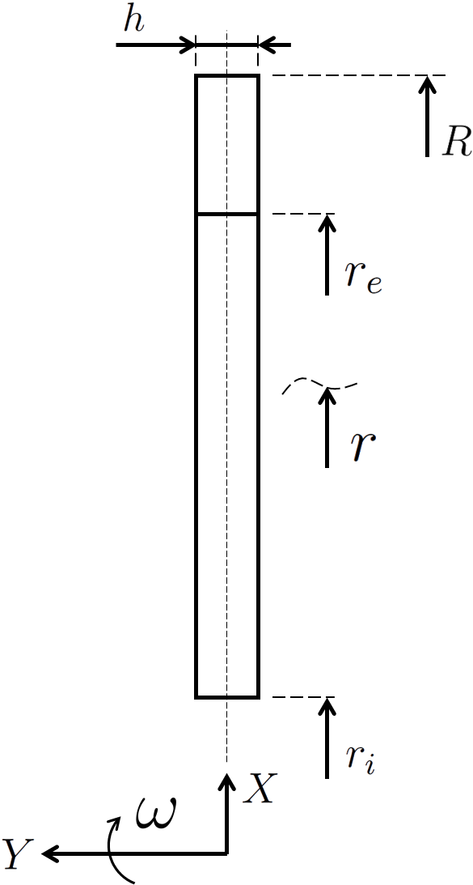   
    <b>Figure</b> Parametric rotating blisk.

There are **_N_** number of blades in 360 degrees. Blades are rectangular prisms and span from **_r_e_** to **_R_**, i.e., the blade height is  **_R - r_e_**. The blisk is made of a linear elastic metal with an elasticity modulus of **_E_**, Poisson's ratio of **_nu_**, and density of **_gamma_**. A blade has a width of **_w_**.

The problem geometry with given parameter values is illustrated in the following [Figure](images/blisk_with_given_parameters.png). 

    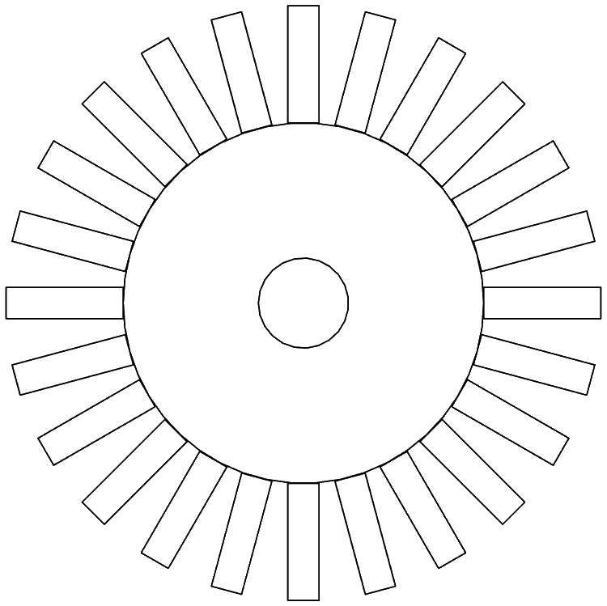   
    <b>Figure</b> Rotating blisk with given parametric values.

The blades are assumed as rectangular prisms as show in the following [Figure](images/parametric_blade.png). 

    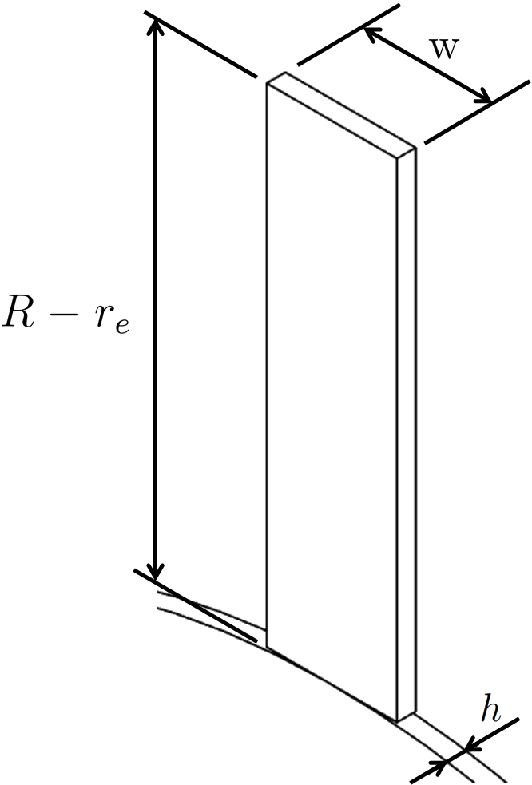   
    <b>Figure</b> Parametric blade dimensions.

The ratio of the total volume of the blades to the volume of the corresponding solid ring between radii **_r_e_** and **_R_** is **_k_**. The volume of the corresponding full ring prior to the machining of the blades is shown in the following [Figure](images/full_ring_prior_to_blade_machining.png).

    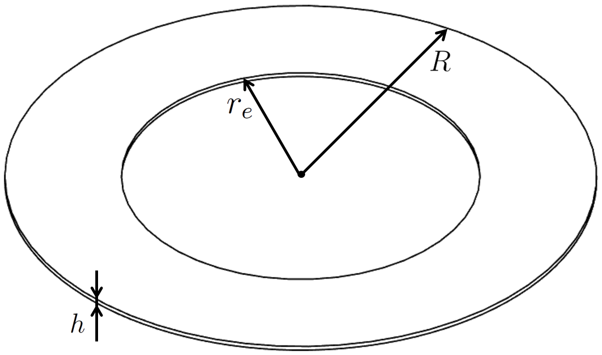   
    <b>Figure</b> The volume of the corresponding full ring prior to the machining of the blades.

The radial stresses, hoop stresses, and radial displacements along the blisk symmetry axis between the bore radius, **_r_i_**  and the hub radius **_r_e_** are calculated. The parameters can be varied in the respective files.

## Solution: The Theory of Elasticity

The rotating blisk problem can be considered as the superposition of two elastic problems.

* Non-rotating annular disk with radial stress applied at the outer radius,
* Rotating annular disk of same size.

See the [study report](blisk_tex.pdf) for the Theory of Elasticity solution to these two problems.

[A MATLAB code](blisk_matlab.m) is written to calculate and plot the radial stresses, hoop stresses, and radial displacements along the blisk symmetry axis from the bore radius **_r_i_**  to te hub radius **_r_e_**. The radial and hoop stresses are shown  in the following [Figure](images/analytical_solution_stress.png).

    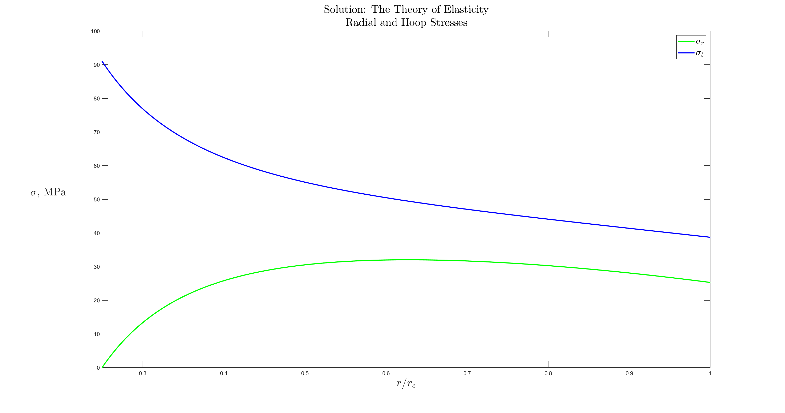   
    <b>Figure</b> Theory of Elasticity solution for radial and hoop stresses.

and the radial displacements are shown in the following [Figure](images/analytical_solution_disp.png).

    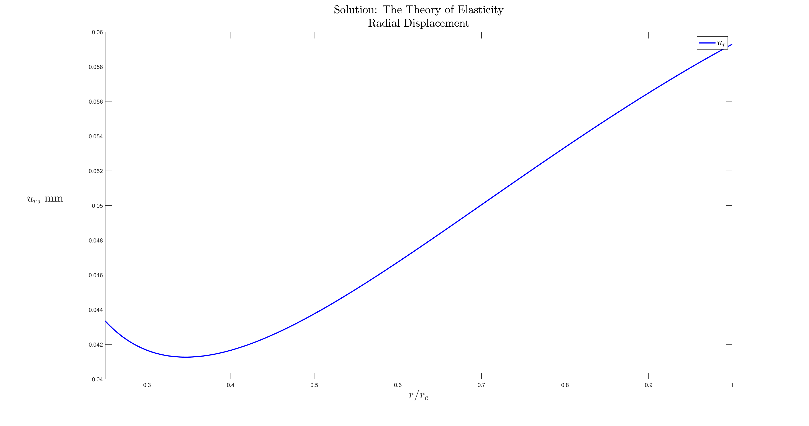   
    <b>Figure</b> Theory of Elasticity solution for radial displacements.

## Solution: Finite Element Analysis with CalculiX

A parametric finite element [model](blisk_pre.fbd) for CalculiX is created to compare finite element results with the theory of elasticity results.

In CalculiX, the disk portion is modelled using axisymmetric elements (qu8cr, CAX8R), and the blade portion is modelled using plane stress elements (qu8sr, CPS8R) with thickness.

The thickness of the plane stress elements needs to be determined such that the centrifugal force due to the rotating mass of the blades is correctly included in the two-dimensional finite element analysis. See the [study report](blisk_tex.pdf) for the calculation of the plane stress element thickness. The total volume of the blades illustrated in the following [Figure](images/total_volume_of_blades.png), is equated to the volume of the corresponding full ring prior to the machining of the blades times **_k_**.

    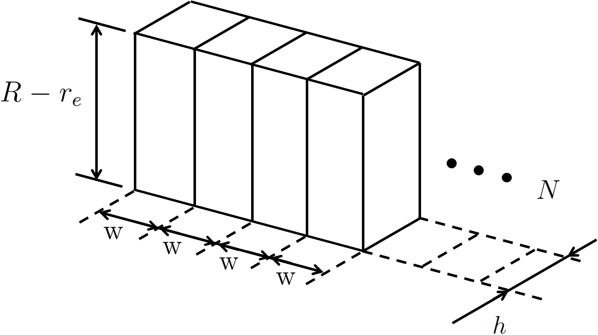   
    <b>Figure</b> The total volume of blades.

The radial stress, hoop stress, and radial displacement results from CalculiX are shown in the following figures.

    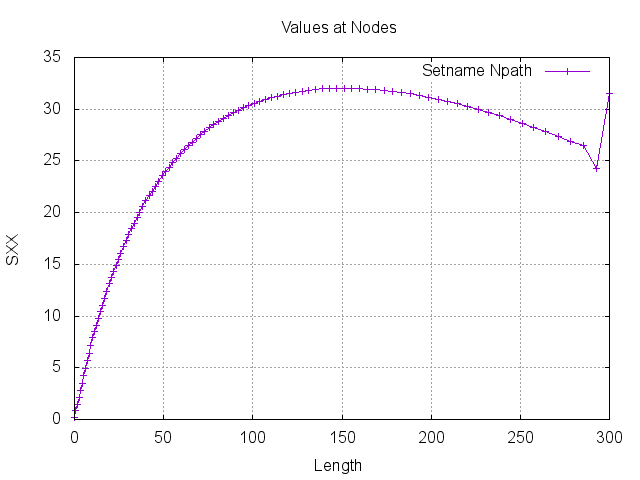   
    <b>Figure</b> CalculiX radial stress plot.

    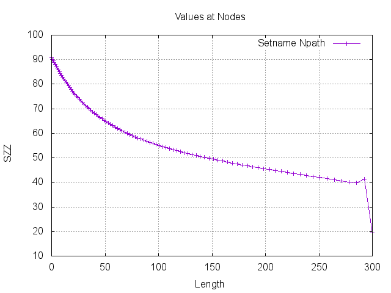   
    <b>Figure</b> CalculiX hoop stress plot.

    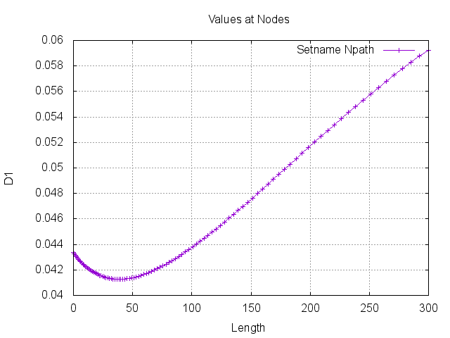   
    <b>Figure</b> CalculiX radial displacement plot.

## Comparison

Dimensionless stresses and displacement are defined in the following [Figure](images/dimensionless_definitions.png) 

    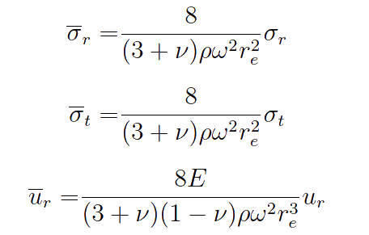   
    <b>Figure</b> Dimensionless stress and displacement definitions.

Comparison between the analytical results obtained from MATLAB and finite element results obtained from CalculiX are presented in the following [Figure](images/blisk_analytical_vs_fe.png). It can be observed from this figure that the finite element results from CalculiX are the same as the analytical solution except in the very close proximity to the plane stress elements.

    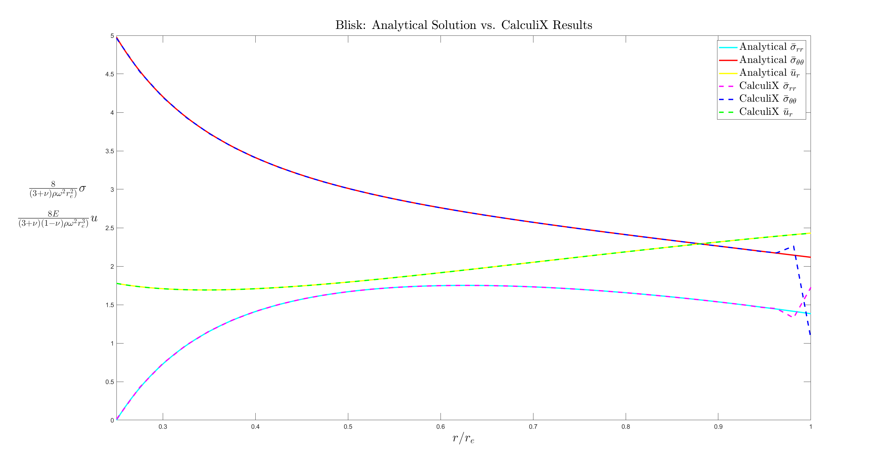   
    <b>Figure</b> Two-dimensional rotating blisk: Analytical solution vs. CalculiX results.

The following table compares the maximum stresses, and the displacements at bore and hub radii between the analytical results and finite element solution.

|                                           | Analytical Solution, MATLAB   | Finite Element Results, CalculiX  |                         
| :-------------                            |  :----                        | :----                             |
| Maximum radial stress                     | 32 MPa                        | 32 MPa                            |
| Maximum hoop stress                       | 91 MPa                        | 91 MPa                            |
| Radial displacement at the bore radius    | 0.043353 mm                   | 0.043348 mm                       |
| Radial displacement at the hub radius     | 0.059294 mm                   | 0.059241 mm                       |

