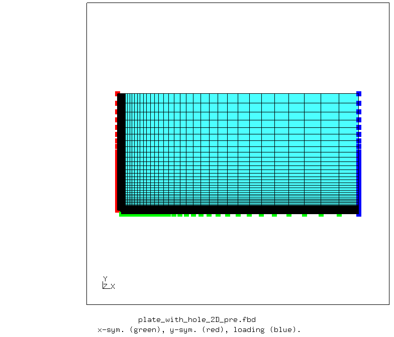
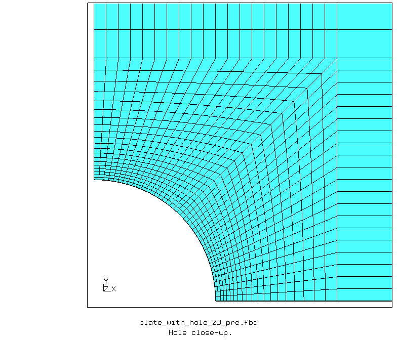
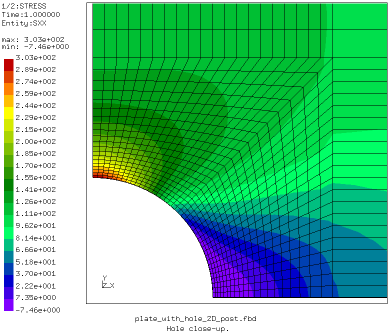

# CalculiX Benchmark Study: 2D Plate with Hole in Tension

The solution to the problem of plate with a central circular hole subjected to far-field tension is known from the Theory of Elasticity as presented [here](https://en.wikiversity.org/wiki/Introduction_to_Elasticity/Plate_with_hole_in_tension). 

Two-dimensional stress analysis is performed with the free and open-source finite element analysis software [CalculiX](http://www.calculix.de/). 

### Files
File| Contents|                        
:-------------| :-------------|                   
[plate_with_hole_2D_pre.fbd](plate_with_hole_2D_pre.fbd)| Pre-processing script for CalculiX GraphiX|
[plate_with_hole_2D.inp](plate_with_hole_2D.inp) | CalculiX input|
[plate_with_hole_2D_post.fbd](plate_with_hole_2D_post.fbd)| Post-processing script for CalculiX GraphiX|               
[plate_with_hole_2D_py.py](plate_with_hole_2D_py.py)| Python script to run CalculiX files|

## Pre-processing

A parametric pre-processing script is written for CalculiX GraphiX ([plate_with_hole_2D_pre.fbd](plate_with_hole_2D_pre.fbd)). The geometry is created and meshed using the defined parameter values. Only a quarter of the plate is modelled with symmetry boundary conditions applied at relevant faces.

       
    <b>Figure</b> Two-dimensional finite element model of the plate with hole.

       
    <b>Figure</b> Close-up view of the hole.

## Solution: Finite Element Analysis with CalculiX

In CalculiX, the plate is modelled using plane stress elements.

An input file is written to run the two-dimensional disk model in CalculiX ([plate_with_hole_2D.inp](plate_with_hole_2D.inp)).

## Post-processing

A post-processing script is written for CalculiX GraphiX ([plate_with_hole_2D_post.fbd](plate_with_hole_2D_post.fbd)).

       
    <b>Figure</b> Stress plot at the hole.

