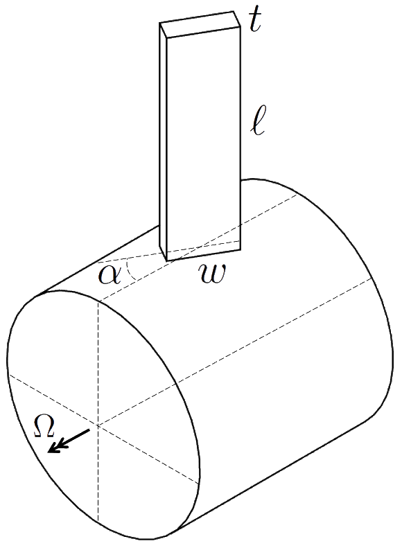
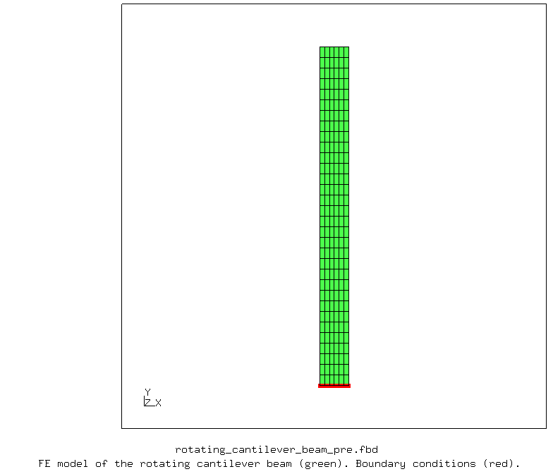
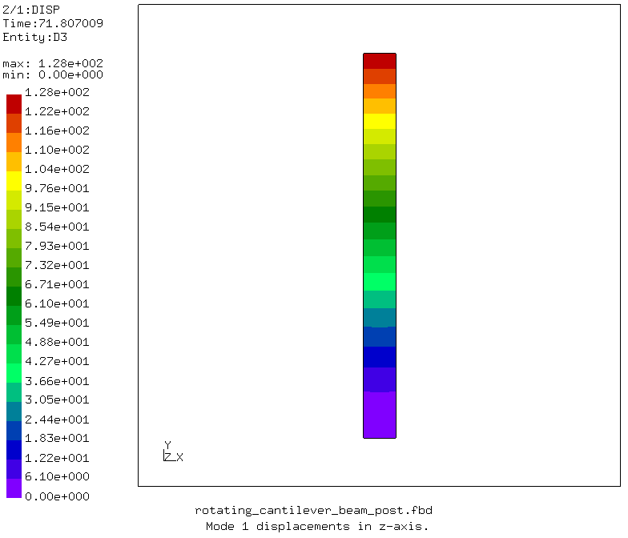

# Vibration of a Rotating Cantilever Beam
This study demonstrates the natural frequency analysis of a cantilever beam subjected to centrifugal loading. This is analogous to the vibrations of compressor and turbine blades. The free and open-source finite element analysis software [CalculiX](http://www.calculix.de/) is used.

File| Contents|                        
:-------------| :-------------|                   
[rotating_cantilever_beam_pre.fbd](rotating_cantilever_beam_pre.fbd)| Pre-processing script for CalculiX GraphiX|
[rotating_cantilever_beam.inp](rotating_cantilever_beam.inp) | CalculiX input|
[rotating_cantilever_beam_post.fbd](rotating_cantilever_beam_post.fbd)| CalculiX GraphiX post-processing script|               
[rotating_cantilever_beam_py.py](rotating_cantilever_beam_py.py)| Python script to run the example|
[rotating_cantilever_beam_tex.tex](rotating_cantilever_beam_tex.tex)| LaTeX file for the study report|
[rotating_cantilever_beam_tex.pdf](rotating_cantilever_beam_tex.pdf)| LaTeX output pdf for the study report|
    
## Parameters

| Parameter         | Value     | Unit      | Description                            |
| :-------------    |  :----    | :----     | :-------------                         |
| `r`               | 150       | mm        | Radius of the rigid disk               |
| `Omega`           | 4500      | rpm       | Rotational speed of the rigid disk     |
| `l`               | 328       | mm        | Lenght of the beam                     |
| `w`               | 28        | mm        | Width of the beam                      |
| `t`               | 3         | mm        | Thickness of the beam                  |
| `alpha`           | 0         | degrees   | Orientation of the beam                |
| `E`               | 2.1e5     | MPa       | Young's modulus of the beam materal    |
| `nu`              | 0.3       |           | Poisson's ration of the beam material  |
| `Etyp`            | he20r     |           | Element type of the beam (C3D20R)      |

## Description

The beam is built into a rigid disk of **_r mm_** radius, rotating about its axis at a speed of **_Omega rpm_**. It is **_l mm_** long, **_w mm_** wide, **_t mm_** thick, and makes an angle of **_alpha degrees_** with the rotation axis, as shown in the following [Figure](images/rotating_cantilever_beam.png).

       
    <b>Figure</b> Rotating cantilever beam.

## Pre-processing

The beam is made of steel, with a Young's modulus **_2.17e5 MPa_**, Poisson's ratio of **_0.3_** and a density of **_7.85e-9 tonne/mm^3_**.

The general purpose quadratic brick element with reduced integration (C3D20R) is used. The the beam is cantilevered at **_r = 150 mm_**. A rotational speed of **_Omega = 4500 rpm_** about the axis of the rigid disk is applied to the whole model. See the following [Figure](images/pre.png) for the finite element model of the rotating cantilever beam. 

       
    <b>Figure</b> Finite element model of the rotating cantilever beam.

## Results

The first vibration mode is obtained as **_71.81 Hz_** from CalculiX. This result is can be compared with the results reported for Abaqus 6.6 in this [Reference](https://classes.engineering.wustl.edu/2009/spring/mase5513/abaqus/docs/v6.6/books/bmk/default.htm?startat=ch01s04ach43.html). Followign table shows the first three modes obtained with CalculiX.

| Mode         | Frequency [Hz]     |
| :-------------    |  :----        |
| 1                 | 71.807009     |
| 2                 | 243.222157    |
| 3                 | 273.155573    |

Following [Figure](images/post.png) shows the displacements of the first mode.

       
    <b>Figure</b> Mode 1 displacements in z-axis.

