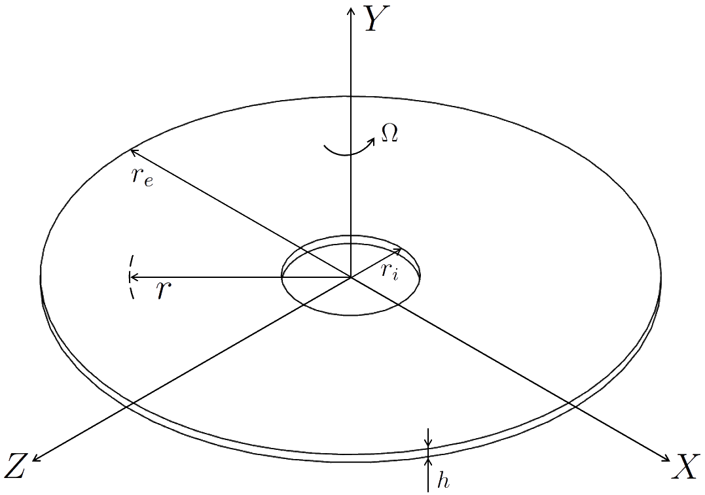
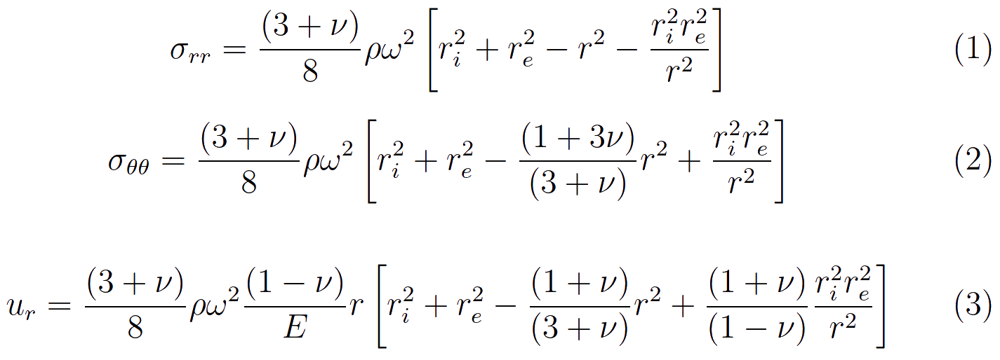
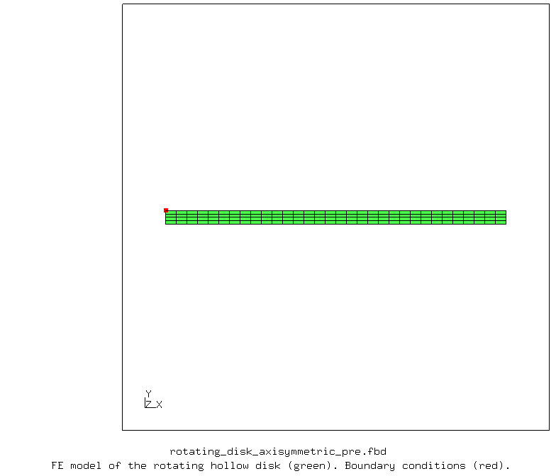
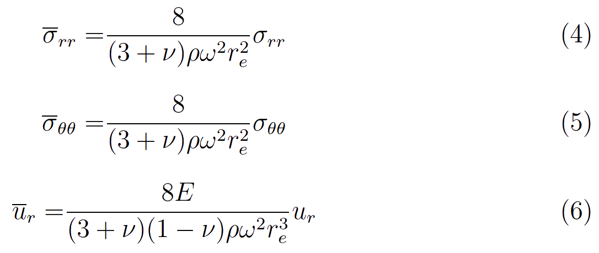
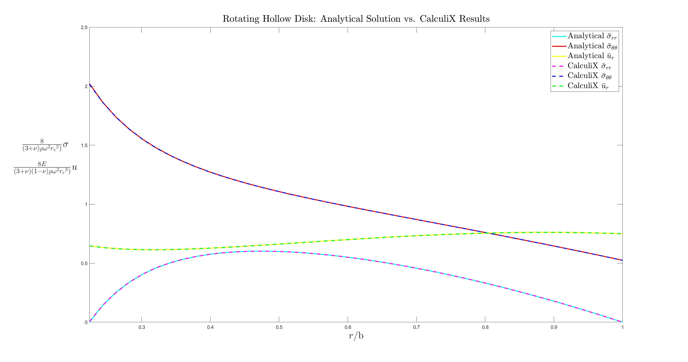
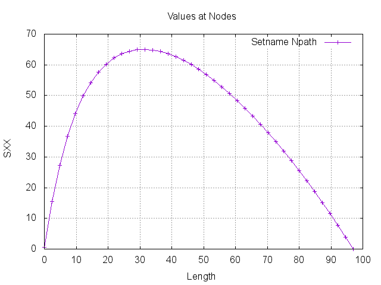
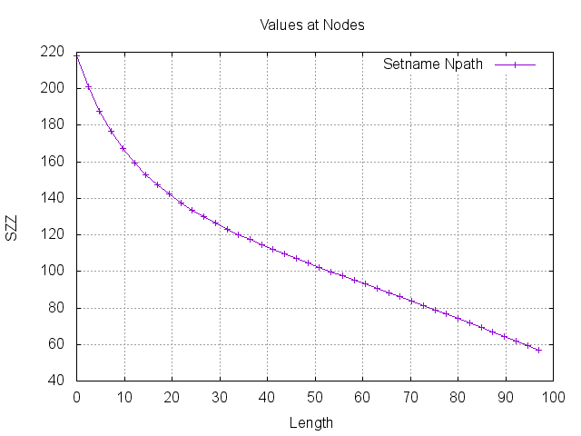
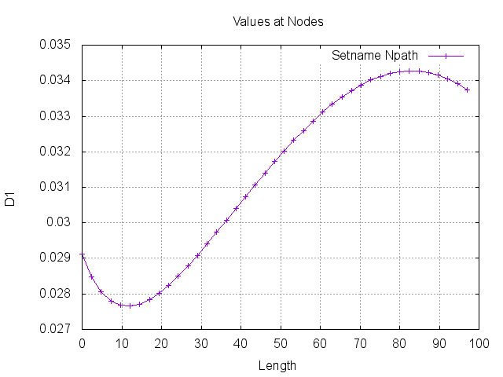

# CalculiX Benchmark Study: Rotating Hollow Disk

Theoretical and finite element analysis results of the rotating hollow disk problem are compared. The free and open-source finite element analysis software [CalculiX](http://www.calculix.de/) is used. The hollow disk is modelled using axisymmetric elements in CalculiX.

File| Contents|                        
:-------------| :-------------|                   
[rotating_disk_axisymmetric_pre.fbd](rotating_disk_axisymmetric_pre.fbd)| Pre-processing script for CalculiX GraphiX|
[rotating_disk_axisymmetric.inp](rotating_disk_axisymmetric.inp) | CalculiX input|
[rotating_disk_axisymmetric_post.fbd](rotating_disk_axisymmetric_post.fbd)| CalculiX GraphiX post-processing script|               
[run_rotating_disk_axisymmetric_py.py](run_rotating_disk_axisymmetric_py.py)| Python script to run CalculiX files|
[load_calculix_data.m](load_calculix_data.m)| MATLAB file that loads CalculiX results to MATLAB workspace|
[rotating_disk_analytical_vs_calculix_matlab.m](rotating_disk_analytical_vs_calculix_matlab.m)| Main MATLAB file|
[rotating_disk_axisymmetric_tex.tex](rotating_disk_axisymmetric_tex.tex)| LaTeX file for the study report|
[rotating_disk_axisymmetric_tex.pdf](rotating_disk_axisymmetric_tex.pdf)| LaTeX output pdf for the study report|

## Parameters

| Parameter         | Value     | Unit          | Description                           |
| :-------------    |  :----    | :----         | :-------------                        |
| `r_i`             | 28        | mm            | Inner radius of the disk              |
| `r_e`             | 125       | mm            | Outer radius of the disk              |
| `h`               | 4         | mm            | Thickness of the disk                 |
| `E`               | 2.1e5     | MPa           | Young's modulus of the disk material   |
| `nu`              | 0.3       |               | Poisson's ration of the disk material |
| `rho`             | 7.85e-9   | tonne/mm^3    | Density of the disk material          |
| `Omega`           | 14e3      | rpm           | Rotational speed of the disk          |
| `Etyp`            | qu8cr     |               | Element type of the beam (CAX8R)      |

## Description

Rotating hollow disk problem is shown in the following [Figure](images/rotating_disk_axisymmetric.png).

       
    <b>Figure</b> Rotating hollow disk.

### Theory of Elasticity: Thin Rotating Hollow Disk

Theory of elasticity gives the following results for the rotating hollow disk problem. Radial stress, hoop stress, and radial displacement are given in the following [Figure](images/theory_of_elasticity_solution_for_rotating_hollow_disk.png) in Eqs. 1, 2, and 3, respectively. See [reference book](https://www.springer.com/gp/book/9788847025615).

       
    <b>Figure</b> Theory of elasticity solution for thin rotating hollow disk.

## Pre-processing

The general purpose quadratic axisymmetric element with reduced integration (CAX8R) is used. One node at inner radius, r_i, is constrained in the axial direction. The finite element model of the rotating hollow disk problem is shown in the following [Figure](images/pre.png).

       
    <b>Figure</b> Finite element model of the rotating hollow disk.

## Results and Comparison

Dimensionless stresses and displacement are defined in the following [Figure](images/dimensionless_definitions.png) in Eqs. 4, 5, and 6. 

       
    <b>Figure</b> Dimensionless stress and displacement definitions.

Comparison between the analytical results obtained from MATLAB and finite element results obtained from CalculiX are presented in the following [Figure](images/rotating_disk_analytical_vs_fe.png).

       
    <b>Figure</b> Rotating hollow disk: Analytical solution vs. CalculiX results.

The following table compares the minimum and maximum stresses, and displacements at inner and outer radii between analytical results and finite element solution.

|                                           | Analytical Solution, MATLAB   | Finite Element Results, CalculiX  |                         
| :-------------                            |  :----                        | :----                             |
| Maximum radial stress                     | 65 MPa                        | 65 MPa                            |
| Minimum radial stress                     | 0 MPa                         | 0 MPa                             |
| Maximum hoop stress                       | 218 MPa                       | 218 MPa                           |
| Minimum hoop stress                       | 0 MPa                         | 0 MPa                             |
| Radial displacement at the inner radius   | 0.029119 mm                   | 0.029116 mm                       |
| Radial displacement at the outer radius   | 0.033738 mm                   | 0.033731 mm                       |

The radial stress, hoop stress, and radial displacements from CalculiX is following figures. Finite element results are extracted from the midline of the 2D axisymmetric disk from inner radius, r_i, to the outer radius, r_e.

       
    <b>Figure</b> CalculiX radial stress plot.

       
    <b>Figure</b> CalculiX hoop stress plot.

       
    <b>Figure</b> CalculiX radial displacement plot.

