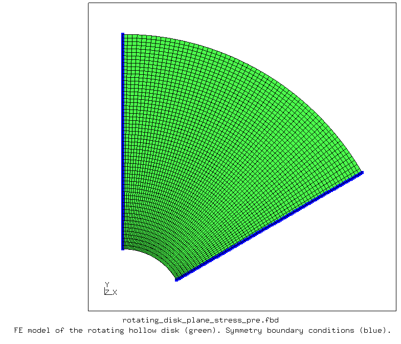
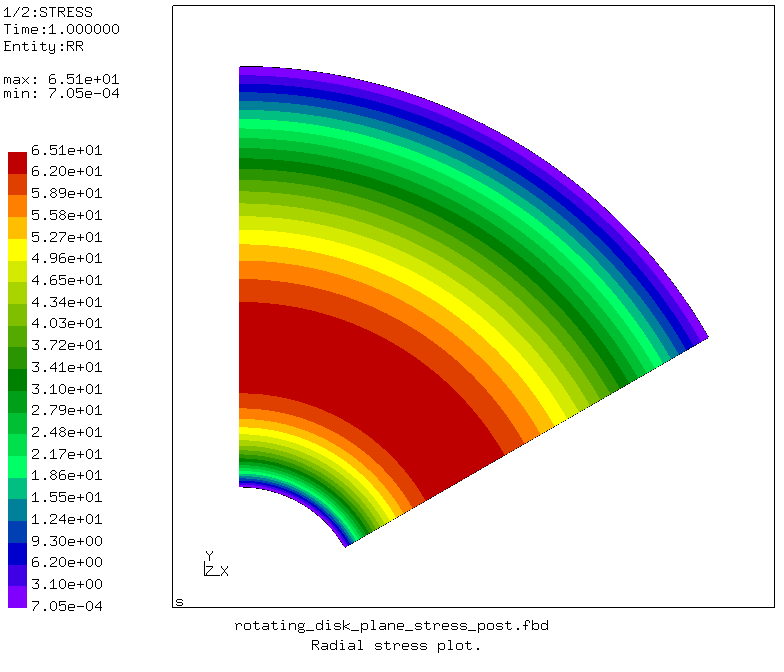
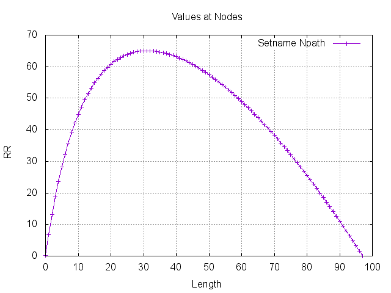
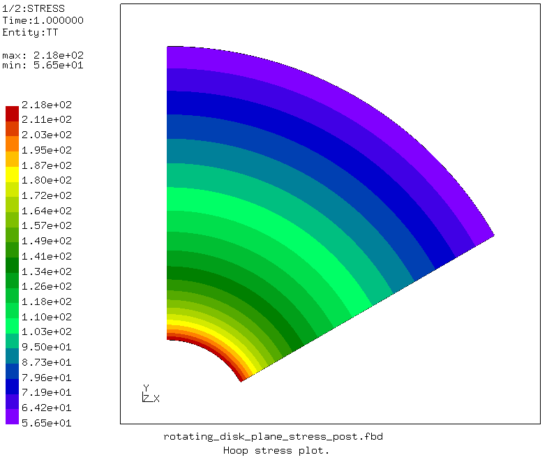
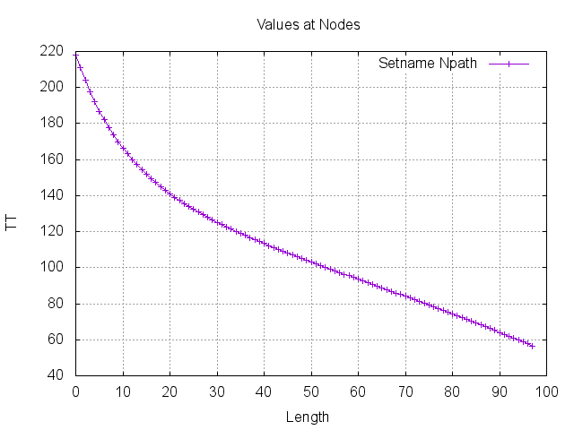
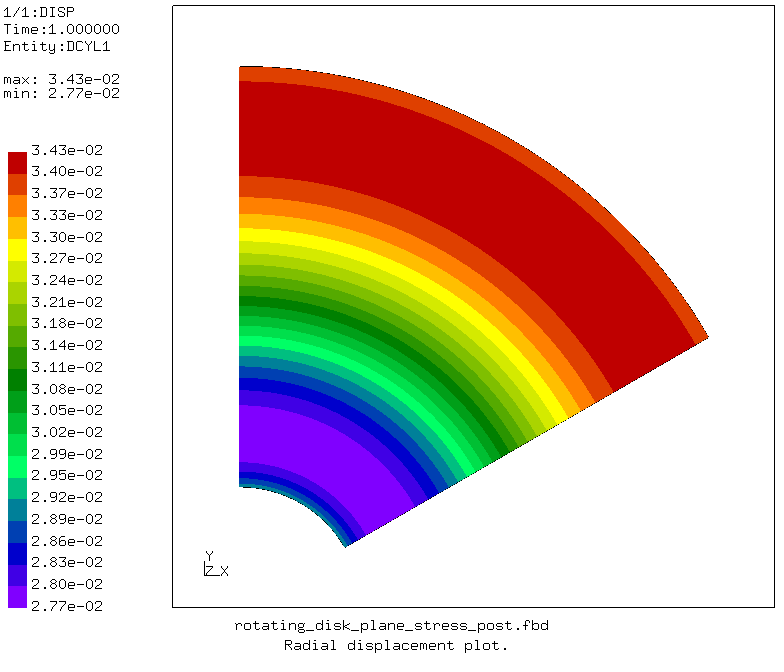
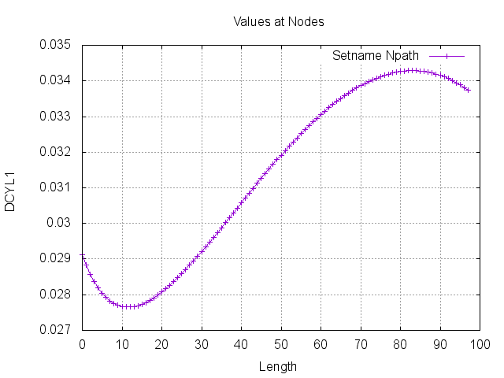

# Rotating Hollow Disk with Plane Stress Elements

Rotating hollow disk problem [described here](https://github.com/suleymanmuti/CalculiX-Examples/tree/master/rotating_disk_axisymmetric) is solved with plane stress elements. The free and open-source finite element analysis software [CalculiX](http://www.calculix.de/) is used.

File| Contents|                        
:-------------| :-------------|                   
[rotating_disk_plane_stress_pre.fbd](rotating_disk_plane_stress_pre.fbd)| Pre-processing script for CalculiX GraphiX|
[rotating_disk_plane_stress.inp](rotating_disk_plane_stress.inp) | CalculiX input|
[rotating_disk_plane_stress_post.fbd](rotating_disk_plane_stress_post.fbd)| CalculiX GraphiX post-processing script|               

## Parameters

| Parameter         | Value     | Unit          | Description                           |
| :-------------    |  :----    | :----         | :-------------                        |
| `r_i`             | 28        | mm            | Inner radius of the disk              |
| `r_e`             | 125       | mm            | Outer radius of the disk              |
| `h`               | 4         | mm            | Thickness of the disk                 |
| `E`               | 2.1e5     | MPa           | Young's modulus of the disk material  |
| `nu`              | 0.3       |               | Poisson's ration of the disk material |
| `rho`             | 7.85e-9   | tonne/mm^3    | Density of the disk material          |
| `Omega`           | 14e3      | rpm           | Rotational speed of the disk          |

## Pre-processing

The general purpose quadratic plane stress element with reduced integration (CPS8R) is used. Symmetry boundary conditions are applied to an angular portion of the rotating hollow disk. The finite element model and boundary conditions are shown in the following [Figure](images/pre.png).

       
    <b>Figure</b> Finite element model and boundary conditions of the rotating hollow disk.

## Results and Comparison

The following table compares the minimum and maximum stresses, and displacements at inner and outer radii between analytical results and finite element solution.

|                                           | Analytical Solution, MATLAB   | Finite Element Results, CalculiX  |                         
| :-------------                            |  :----                        | :----                             |
| Maximum radial stress                     | 65 MPa                        | 65 MPa                            |
| Minimum radial stress                     | 0 MPa                         | 0 MPa                             |
| Maximum hoop stress                       | 218 MPa                       | 218 MPa                           |
| Minimum hoop stress                       | 0 MPa                         | 0 MPa                             |
| Radial displacement at the inner radius   | 0.029119 mm                   | 0.029116 mm                       |
| Radial displacement at the outer radius   | 0.033738 mm                   | 0.033735 mm                       |

The radial stress, hoop stress, and radial displacement plots from CalculiX are given below.

       
    <b>Figure</b> CalculiX radial stress plot.

       
    <b>Figure</b> CalculiX radial stress plot.

       
    <b>Figure</b> CalculiX hoop stress plot.

       
    <b>Figure</b> CalculiX hoop stress plot.

       
    <b>Figure</b> CalculiX radial displacement plot.

       
    <b>Figure</b> CalculiX radial displacement plot.

