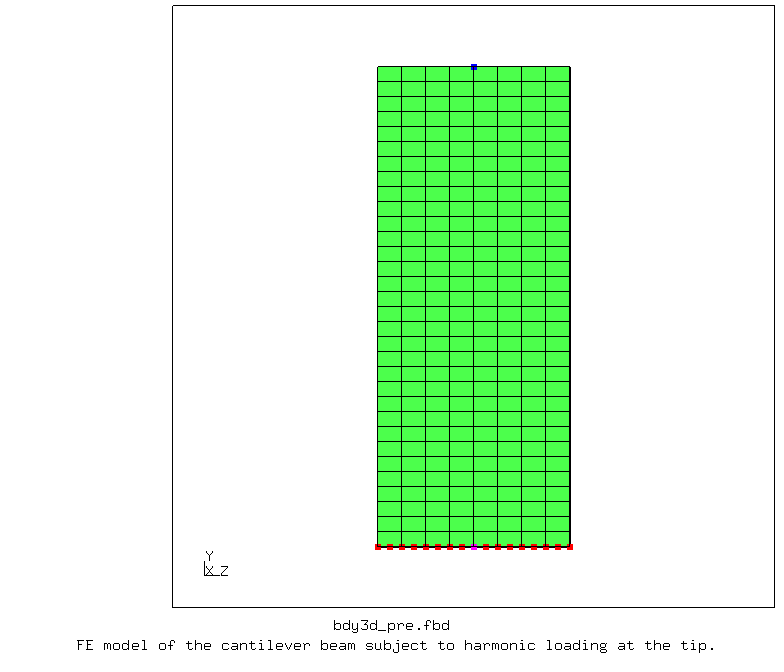
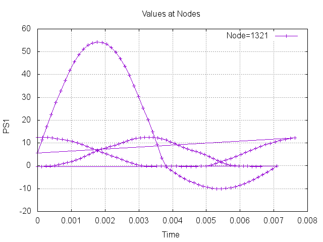
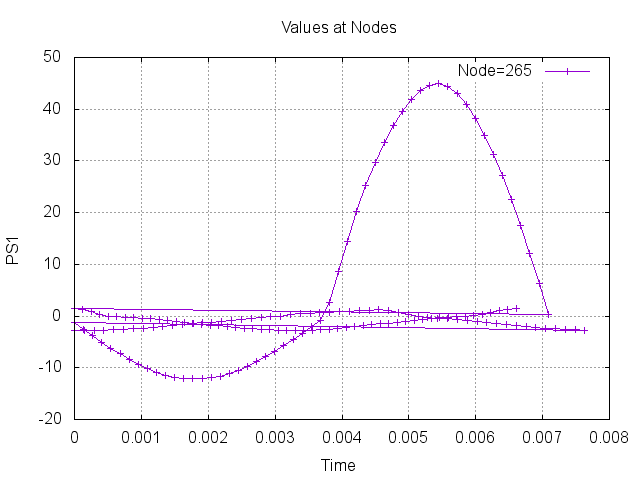
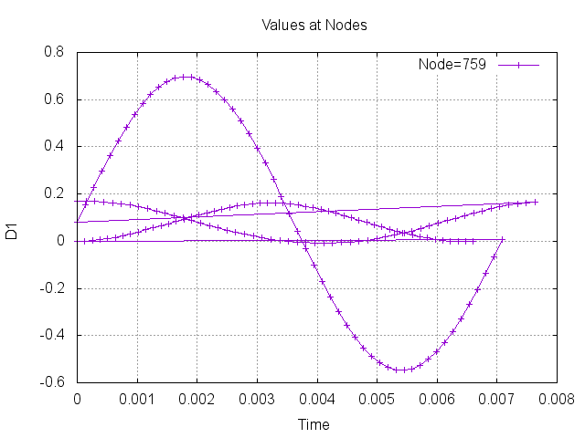

# Cantilever Beam Subjected to Harmonic Loading at the Tip

Nonharmonic periodic loading is applied at the tip of the cantilever beam. 
*STEADY STATE DYNAMICS, HARMONIC=NO

### Files
File| Contents|                        
:-------------| :-------------|                   
[bdy3d_pre.fbd](bdy3d_pre.fbd)| Pre-processing script for CalculiX GraphiX|
[bdy3d.inp](bdy3d.inp) | CalculiX input file|
[bdy3d_run.fbd](bdy3d_run.fbd)| CalculiX GraphiX script to run the analysis and save result plots|               

## Pre-processing

       
    <b>Figure</b> FE model of the cantilever beam subject to harmonic loading at the tip.

### Result plots

       
    <b>Figure</b> Stress at the root vs. frequency. -c.

       
    <b>Figure</b> Stress at the root vs. frequency. +c.

       
    <b>Figure</b> Displacement at the tip vs. frequency.

