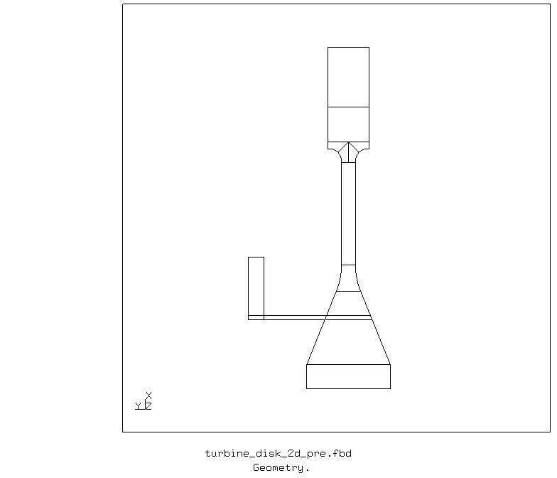
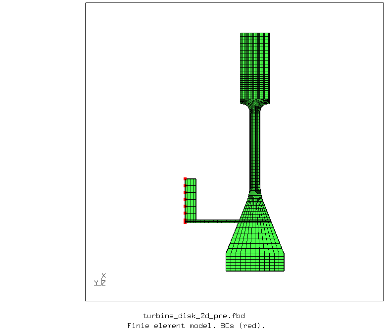
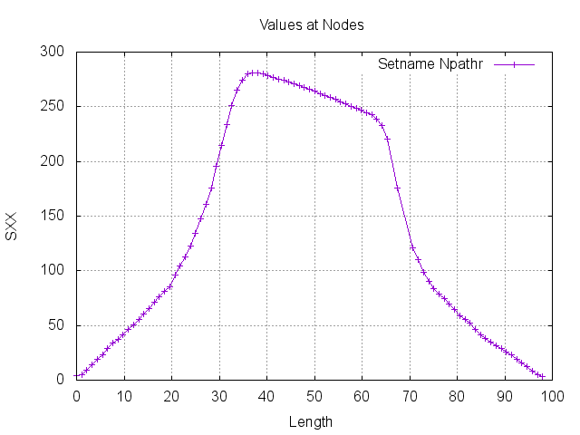
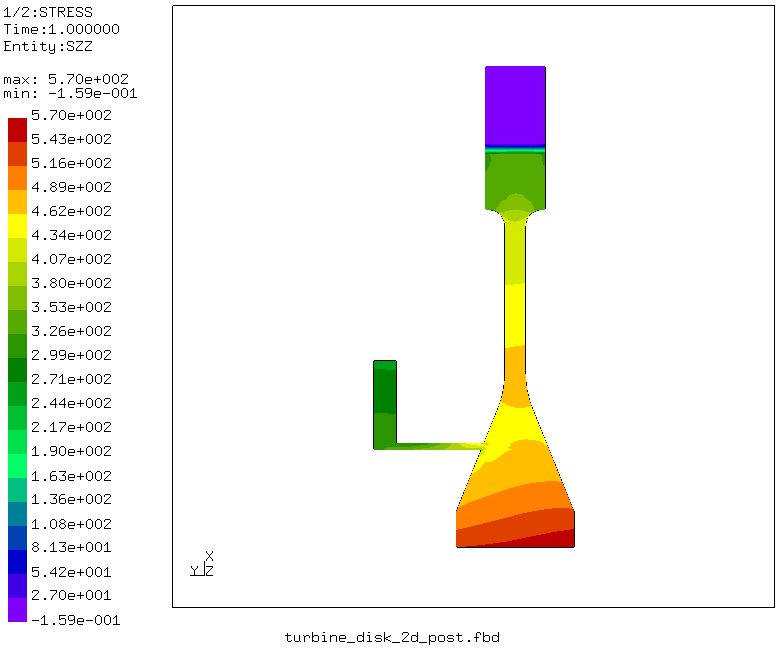
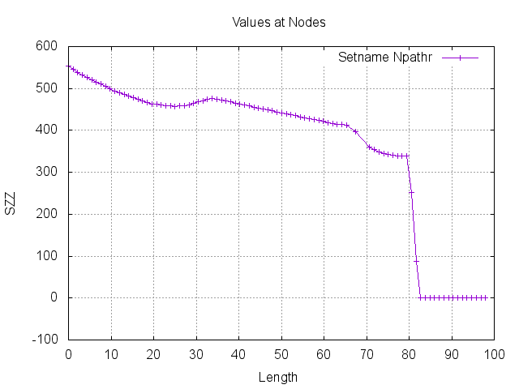
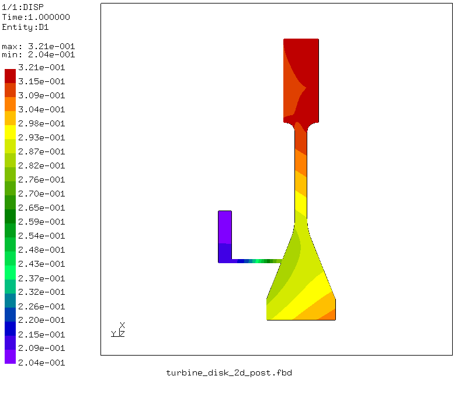
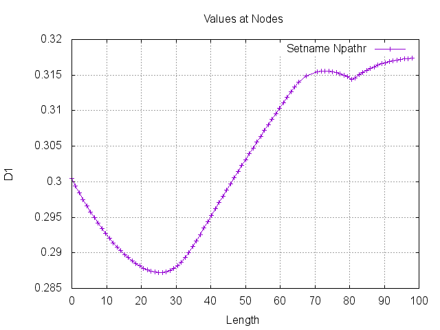

# CalculiX Benchmark Study: 2D Turbine Disk

Two-dimensional finite element analysis of a turbine disk defined in the following paper is performed with free and open-source finite element analysis software [CalculiX](http://www.calculix.de/). 

[Life prediction of a gas turbine disc using the finite element method, disk geometry drawing, 2002](http://citeseerx.ist.psu.edu/viewdoc/download?doi=10.1.1.503.7546&rep=rep1&type=pdf).

### Files
File| Contents|                        
:-------------| :-------------|                   
[turbine_disk_2d_pre.fbd](turbine_disk_2d_pre.fbd)| Pre-processing script for CalculiX GraphiX|
[turbine_disk_2d.inp](turbine_disk_2d.inp) | CalculiX input|
[turbine_disk_2d_post.fbd](turbine_disk_2d_post.fbd)| Post-processing script for CalculiX GraphiX|               
[run_turbine_disk_2d_py.py](run_turbine_disk_2d_py.py)| Python script to run CalculiX files|

## Pre-processing

A parametric pre-processing script is written for CalculiX GraphiX ([turbine_disk_2d_pre.fbd](turbine_disk_2d_pre.fbd)). The geometry is created and meshed using the defined parameter values.

       
    <b>Figure</b> Geometry of the Turbine disk.

       
    <b>Figure</b> Two-dimensional finite element model of the Turbine disk.

## Solution: Finite Element Analysis with CalculiX

In CalculiX, the disk portion is modelled using axisymmetric elements, and the blade portion is modelled using plane stress elements with thickness.

The thickness of the plane stress elements is determined such that the centrifugal force due to the rotating mass of the blades is included in the two-dimensional finite element analysis.

An input file is written to run the two-dimensional disk model in CalculiX ([turbine_disk_2d.inp](turbine_disk_2d.inp)).

## Post-processing

A post-processing script is written for CalculiX GraphiX ([turbine_disk_2d_post.fbd](turbine_disk_2d_post.fbd)).

### Radial stresses

       
    <b>Figure</b> Radial stress plot.

       
    <b>Figure</b> Radial stress line plot along the disk's symmetry axis.

### Hoop stresses

       
    <b>Figure</b> Hoop stress plot.

       
    <b>Figure</b> Hoop stress line plot along the disk's symmetry axis.

### Radial displacements

       
    <b>Figure</b> Radial displacement plot.

       
    <b>Figure</b> Radial displacement line plot along the disk's symmetry axis.

