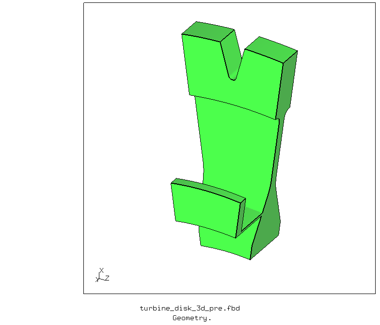
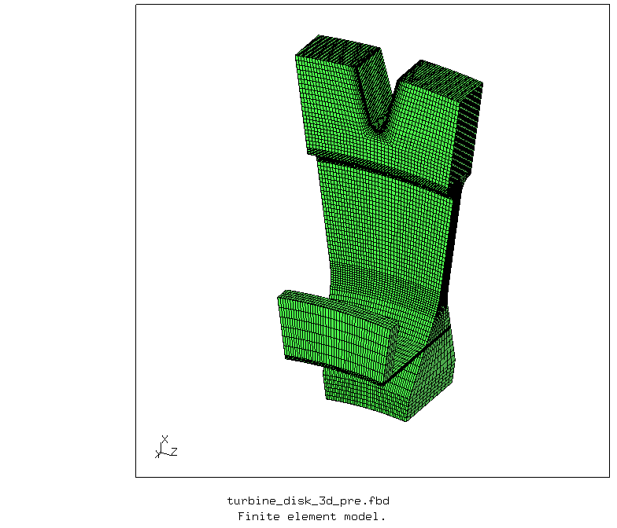
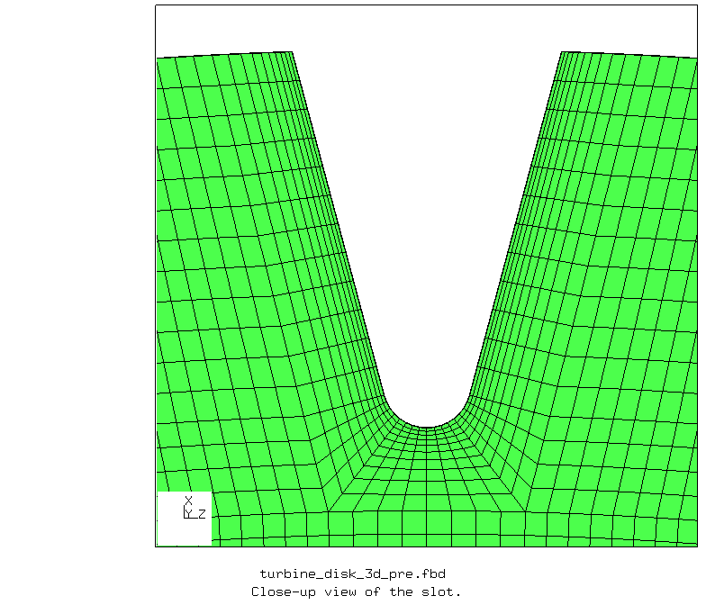
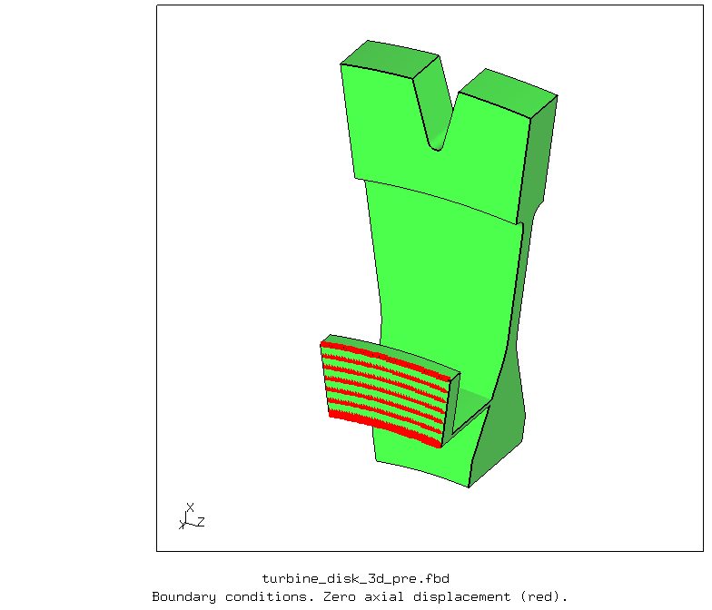
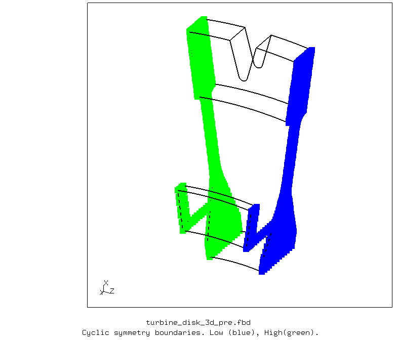
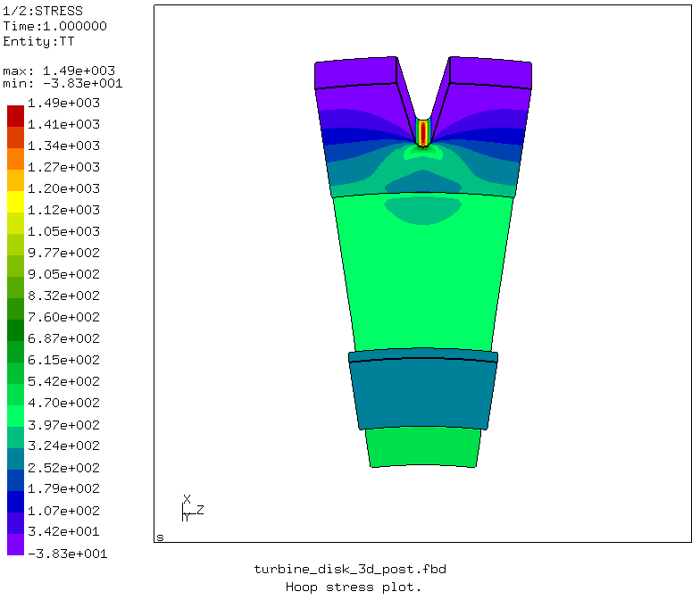
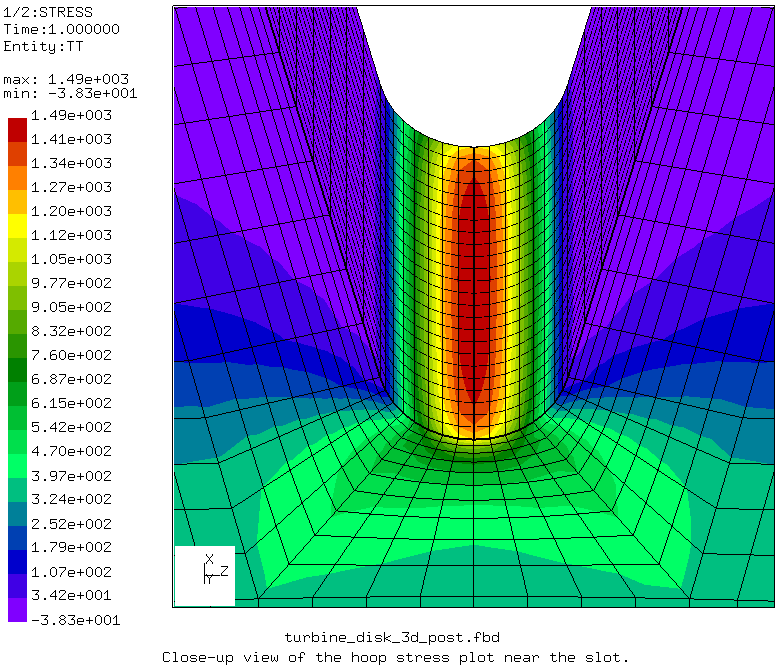
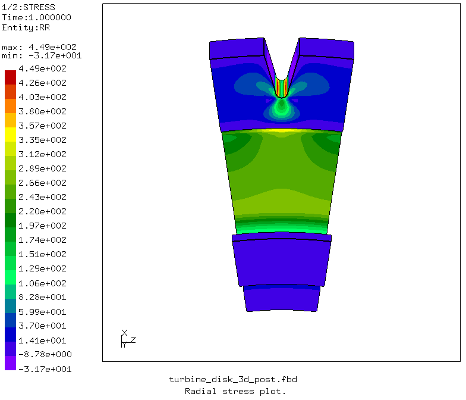
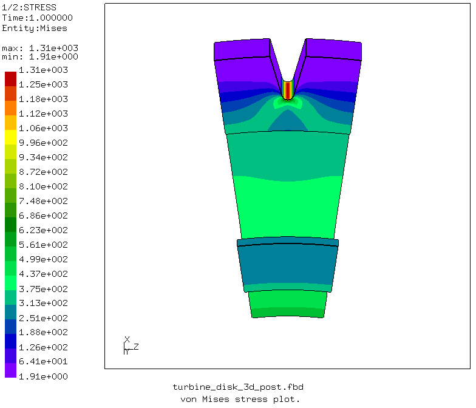

# CalculiX Benchmark Study: 3D Turbine Disk

Three-dimensional finite element analysis of a turbine disk defined in the following paper is performed with free and open-source finite element analysis software [CalculiX](http://www.calculix.de/). The disk is modelled using cyclic symmetry.

[Life prediction of a gas turbine disc using the finite element method, disk geometry drawing, 2002](http://citeseerx.ist.psu.edu/viewdoc/download?doi=10.1.1.503.7546&rep=rep1&type=pdf).

### Files
File| Contents|                        
:-------------| :-------------|                   
[turbine_disk_3d_pre.fbd](turbine_disk_3d_pre.fbd)| Pre-processing script for CalculiX GraphiX|
[turbine_disk_3d.inp](turbine_disk_3d.inp) | CalculiX input|
[turbine_disk_3d_post.fbd](turbine_disk_3d_post.fbd)| Post-processing script for CalculiX GraphiX|               
[run_turbine_disk_3d_py.py](run_turbine_disk_3d_py.py)| Python script to run CalculiX files|

## Pre-processing

A parametric pre-processing script is written for CalculiX GraphiX ([turbine_disk_3d_pre.fbd](turbine_disk_3d_pre.fbd)). The three-dimensional geometry is created using the dimensions given in the [the reference paper](http://citeseerx.ist.psu.edu/viewdoc/download?doi=10.1.1.503.7546&rep=rep1&type=pdf).

       
    <b>Figure</b> Geometry of the Turbine disk.

In CalculiX, the disk is modelled using three-dimensional continuum elements. The mesh density, element type and element order parameters can be changed in the pre-processing script.

       
    <b>Figure</b> Finite element model of the Turbine disk.

       
    <b>Figure</b> Close-up view of the slot.

The axial displacement at the flange is constrained to zero.

       
    <b>Figure</b> Boundary conditions.

The disk is modeled as a cyclic segment. Cyclic symmetry surfaces are defined. The dispacements at the cyclic symmetry surfaces are tied together.

       
    <b>Figure</b> Cyclic symmetry surfaces.

## Solution: Finite Element Analysis with CalculiX

An input file is written to run the three-dimensional cyclic symmetry model of the disk in CalculiX ([turbine_disk_3d.inp](turbine_disk_3d.inp)).

## Post-processing

A post-processing script is written for CalculiX GraphiX ([turbine_disk_3d_post.fbd](turbine_disk_3d_post.fbd)). The following results are obtained with the general purpose linear brick element, C3D8.

### Hoop stresses

       
    <b>Figure</b> Hoop stress plot.

       
    <b>Figure</b> Close-up view of the hoop stress plot near the slot.

### Radial stresses

       
    <b>Figure</b> Radial stress plot.

### von Mises stresses

       
    <b>Figure</b> von Mises stress plot.

## Comparison

The following table compares the results from [the reference paper](http://citeseerx.ist.psu.edu/viewdoc/download?doi=10.1.1.503.7546&rep=rep1&type=pdf) and the results obtained from CalculiX.

Stress component  (MPa)  | Reference paper  (C3D20) | CalculiX  (C3D8) | CalculiX  (C3D20) |
--- | --- | --- | --- |
Hoop stress | 1421 | 1490 | 1470 |
Radial stress | 425 | 449 | 456 |
Axial stress | 256.3 | 287 | 258 |
von Mises stress | 1297 | 1310 | 1350 |

The mesh used in CalculiX is different from the reference paper.

